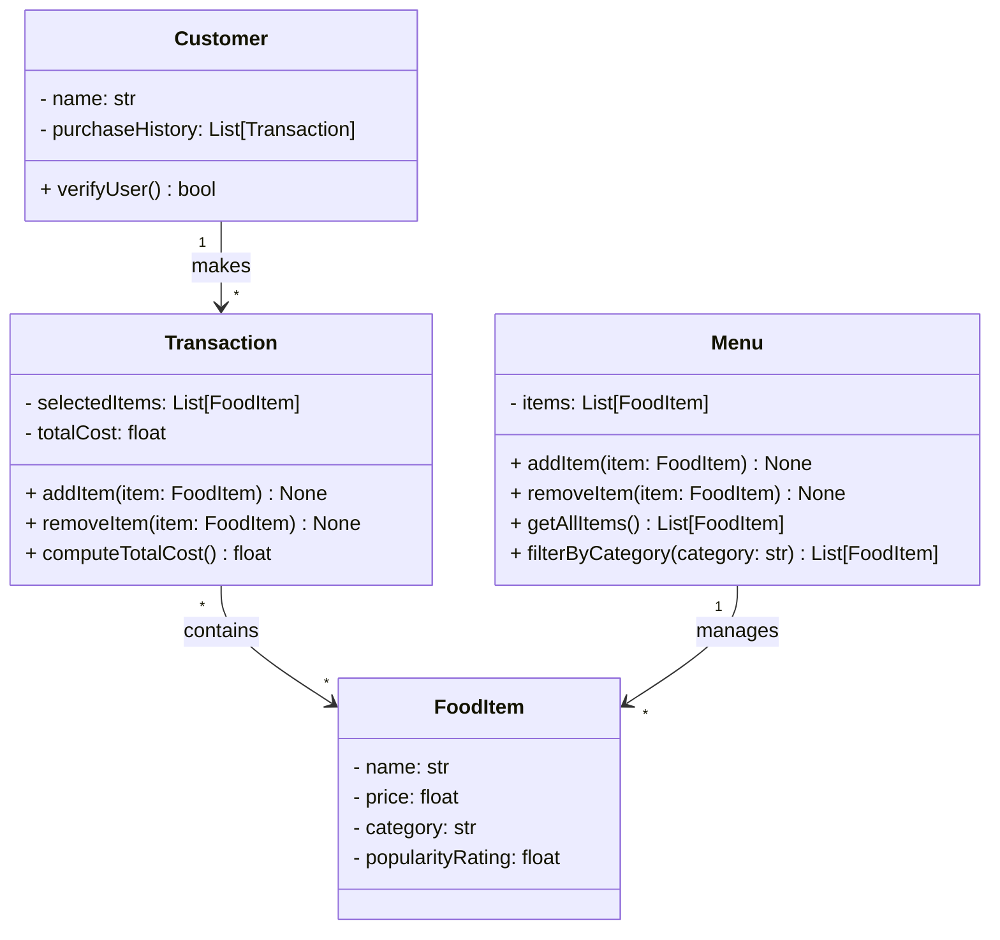

# ByteBites UML Class Diagram

## Mermaid Class Diagram



---

## Alternative: Text-Based Box Diagram

```
┌─────────────────────────────────┐
│         Customer                │
├─────────────────────────────────┤
│ - name: str                     │
│ - purchaseHistory: List[Trans]  │
├─────────────────────────────────┤
│ + verifyUser() → bool           │
└─────────────────────────────────┘
          │
          │ makes (1-to-many)
          │
          ▼
┌─────────────────────────────────┐       ┌──────────────────────────────┐
│      Transaction                │       │      FoodItem                │
├─────────────────────────────────┤       ├──────────────────────────────┤
│ - selectedItems: List[FoodItem] │       │ - name: str                  │
│ - totalCost: float              │       │ - price: float               │
├─────────────────────────────────┤       │ - category: str              │
│ + addItem(item) → None          │       │ - popularityRating: float    │
│ + removeItem(item) → None       │       └──────────────────────────────┘
│ + computeTotalCost() → float    │               ▲
└─────────────────────────────────┘               │
          │                                  │
          │ contains (many-to-many)          │ managed by (1-to-many)
          │                                  │
          └──────────────────────────────────┘
                                             
                                    ┌──────────────────────────────┐
                                    │      Menu                    │
                                    ├──────────────────────────────┤
                                    │ - items: List[FoodItem]      │
                                    ├──────────────────────────────┤
                                    │ + addItem(item) → None       │
                                    │ + removeItem(item) → None    │
                                    │ + getAllItems()→List[Item]   │
                                    │ + filterByCategory(cat)→List │
                                    └──────────────────────────────┘
```

---

## Class Descriptions

### Customer
- **Attributes:**
  - `name`: Customer identifier (string)
  - `purchaseHistory`: Collection of past transactions (list)
- **Key Methods:**
  - `verifyUser()`: Returns a boolean to verify user authenticity

### FoodItem
- **Attributes:**
  - `name`: Item name (e.g., "Spicy Burger", "Large Soda")
  - `price`: Cost of the item (float)
  - `category`: Classification (e.g., "Drinks", "Desserts")
  - `popularityRating`: Measure of item popularity (float)
- **Note:** All attributes are directly accessible as properties; no explicit getter methods

### Menu
- **Attributes:**
  - `items`: Complete collection of available food items (list)
- **Key Methods:**
  - `addItem(item)`: Adds a food item to the menu
  - `removeItem(item)`: Removes a food item from the menu
  - `getAllItems()`: Returns the complete list of items
  - `filterByCategory(category)`: Returns items matching a specific category

### Transaction
- **Attributes:**
  - `selectedItems`: List of food items chosen for this purchase
  - `totalCost`: Calculated total cost (float)
- **Key Methods:**
  - `addItem(item)`: Adds a food item to the transaction
  - `removeItem(item)`: Removes a food item from the transaction
  - `computeTotalCost()`: Calculates and returns the total cost

---

## Relationships

- **Customer → Transaction** (1-to-many): A customer makes multiple transactions over time
- **Transaction ↔ FoodItem** (many-to-many): A transaction contains multiple food items; a food item can appear in multiple transactions
- **Menu → FoodItem** (1-to-many): A menu manages multiple food items
